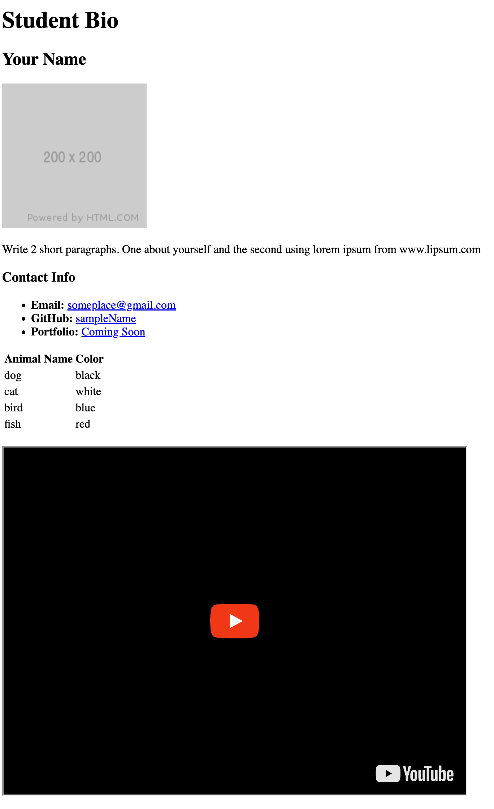

# HTML + Git

## Instructions

In this activity, you’ll create a student bio using HTML.

- Write one paragraph about yourself and then write a second paragraph using Lorem ipsum.
- You will then add, commit, and push your completed HTML to GitHub.

