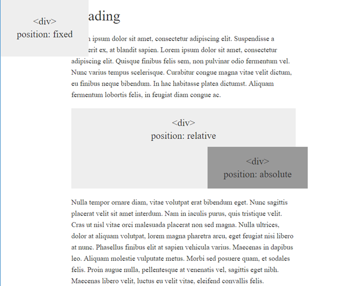

# CSS Positioning

- Create a file called `positioning.css` and link to it from the `positioning.html` file.

- Using CSS, create the layout shown here.

- For reference, the colors used on the screen are `#eee` and `#999`.

- HINT: Use the code from the last few activities to help get you started.
