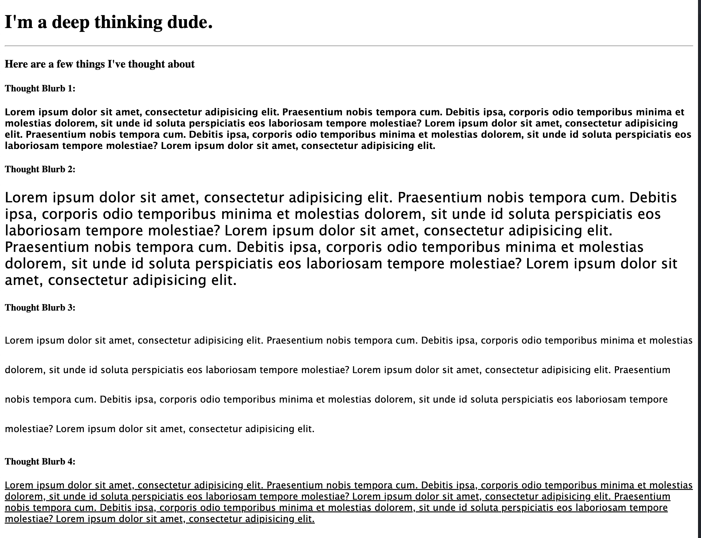

# CSS Typography

In this activity, you'll be modifying CSS properties to style your text in different ways.

## Instructions

- Using the `index.html` file provided to you, create an external CSS stylesheet to modify the typography of each of the body paragraphs.

### Tasks:

1. Change the font family for all paragraphs to `Lucida Grande`.

2. Change the font of the first paragraph to `bold`.

3. Change the font of the second paragraph to `24px`.

4. Change the line height of the third paragraph to `50px`.

5. Change the font of the fourth paragraph to `underline`.

---

### Hint:

You will need to do three things to accomplish this task.

- Link to a CSS page that you'll make

- Create classes for each paragraph

- Add in styles for each class

## Output

