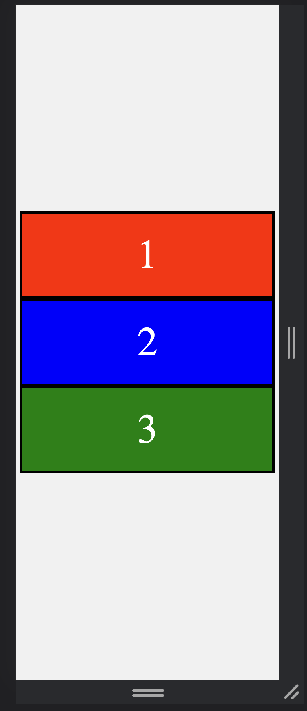
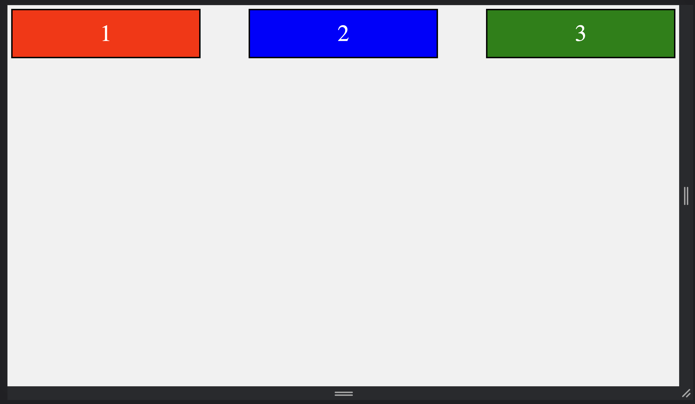

# CSS Typography

In this activity, you'll be using CSS Flexbox to create a dynamic layout for mobile and desktop.

## Instructions

- Using the files provided to you, write CSS and use flexbox and other flex properties to create a dynamic layout that matches the screenshots below.

### Tasks:

1. Link the `reset.css` file to your HTML file.

2. Create and link the `style.css` file to your HTML file.

3. The body color should be `#f1f1f1`

### HINT:

- For this exercise, the desktop breakpoint is >= `1200px`

- Consider designing your layout using the "mobile first" approach.

---

## Outputs

### Mobile View

### Desktop View

