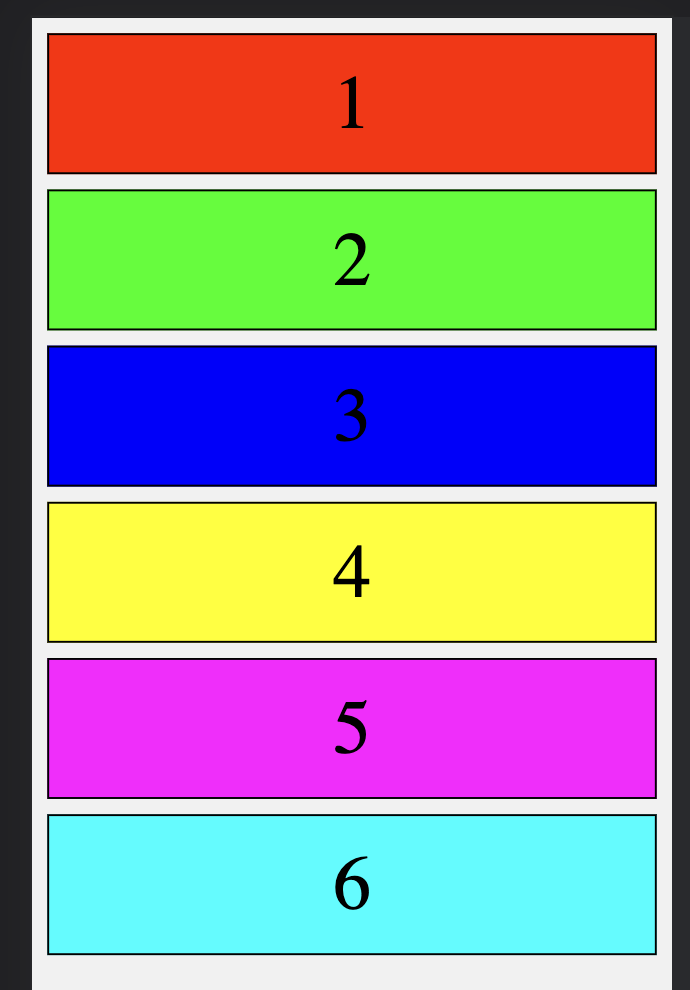
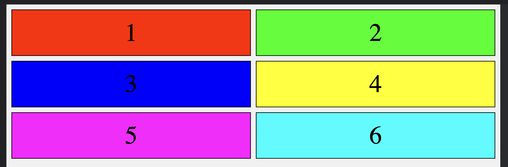
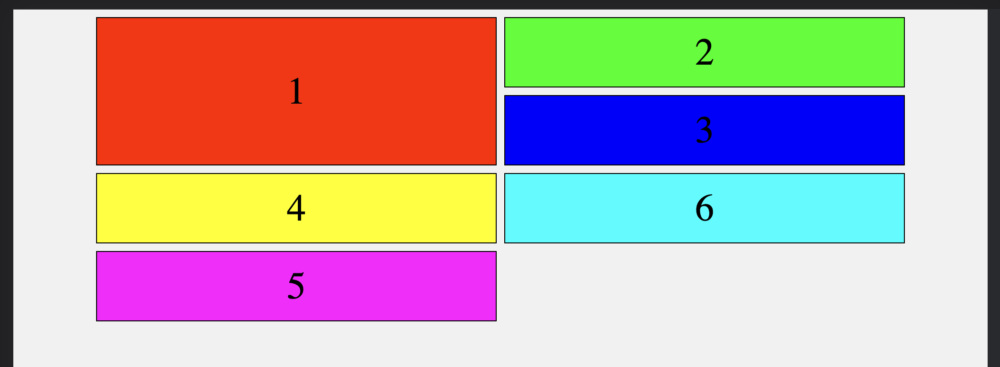
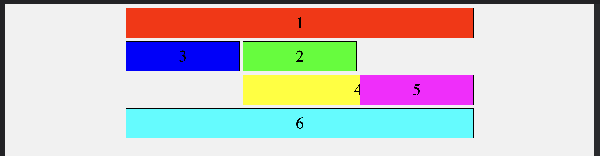

# CSS Grid

In this activity, you'll be using CSS Grid to create a dynamic, responsive layout.

## Instructions

- Using the files provided to you, write CSS using CSS Grid and its properties to create a dynamic layout that matches the screenshots below.

### Tasks:

1. Link the `reset.css` file to your HTML file.

2. Create and link the `style.css` file to your HTML file.

3. The body color should be `#f1f1f1`

4. The grid item colors should be:

   - `#f00` for `#item1`

   - `#0f0` for `#item2`

   - `#00f` for `#item3`

   - `#ff0` for `#item4`

   - `#f0f` for `#item5`

   - `#0ff` for `#item6`

### HINT:

- For this exercise, the breakpoints are as follows:

  - Mobile View (< 768px)

  - Tablet View (< 1024px)

  - Laptop View (< 1440px)

  - XL Laptop View (>= 1440px)

- Consider designing your layout using the "mobile first" approach.

---

## Outputs

### Mobile View (< 768px)

### Tablet View (< 1024px)

### Laptop View (< 1440px)

### XL Laptop View (>= 1440px)

