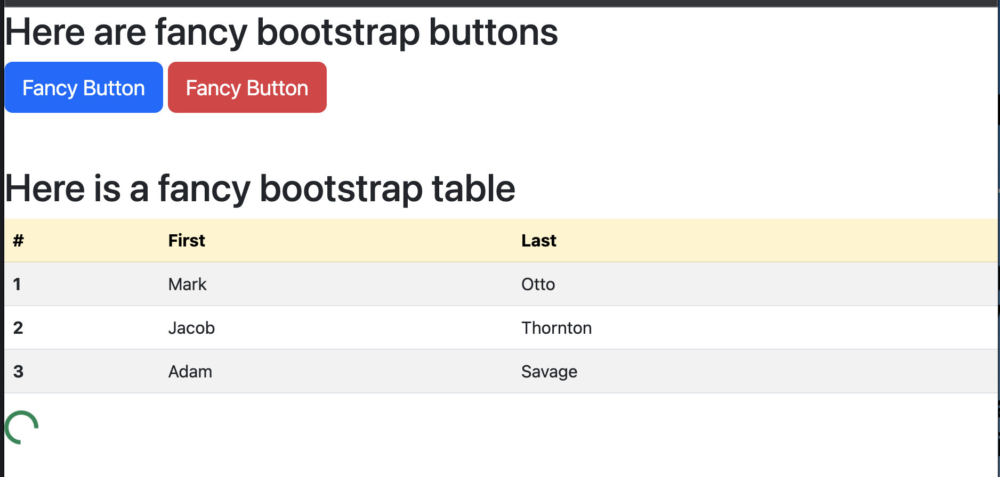

# Bootstrap Intro

In this activity, we'll get some experience working with Bootstrap components.

## Instructions

- Navigate to the Twitter Bootstrap website.

- Then copy the link to the Bootstrap CSS file into the HTML file

- Look through the Bootstrap CSS or Components list and incorporate the necessary HTML, and Bootstrap classes and components to replicate the image below.

---

## Output

