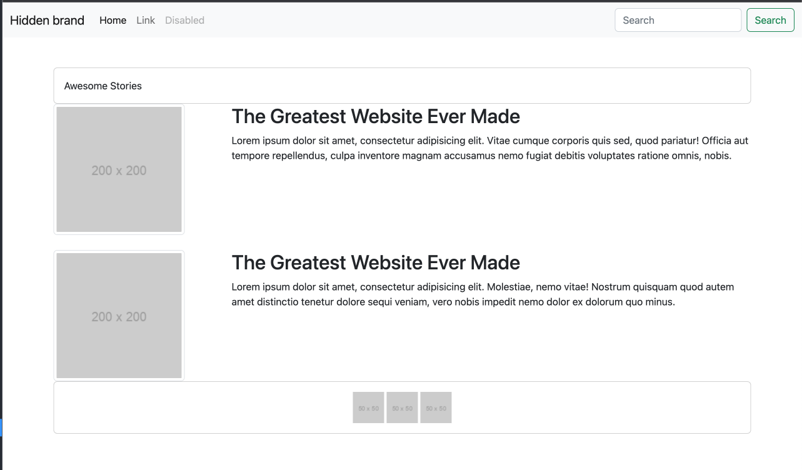

# Website Bootstrap Layout from Scratch

In this activity, we'll get some experience working with Bootstrap grid layout.

## Instructions

- Create an HTML file and link to the Bootstrap CSS CDN.

- Look through the Bootstrap CSS or and implement the necessary HTML, and Bootstrap classes/components to replicate the image below.

---

## Hints

- The images came from Placeholder. An example url is `https://via.placeholder.com/200x200` where the first number is the width and the second number is the height.

- While not strictly necessary, you can look in to the Bootstrap `Card` component for inspiration on an easier solution to certain aspects of the page.

---

## Bonus

- Make your site fully mobile responsive

---

## Output

